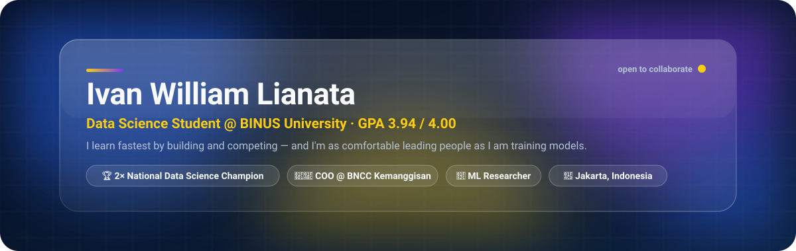
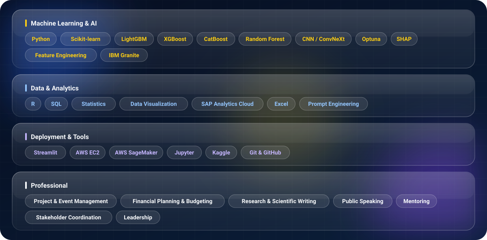

I'm a Data Science student at BINUS University who learns by building and competing — three national Data Science titles so far. I also lead BNCC Kemanggisan (250+ members).

**Recent competitions**

| Competition | Result |
|:--|:--|
| Gammafest 2026 · IPB University | 🥇 1st Place — National |
| SHINE 2025 · BINUS University | 🥇 1st Place — National |
| DataQuest – Objective Quest | 🥉 3rd Place |
| Sebelas Maret Statistics Fair · Data Science Competition | Top 5 Finalist |
| FindIT 2026 Data Analytics | Top 15 of 300+ teams |
| COMPFEST 17 · Universitas Indonesia | Top 10 of 200 teams |

**Recent projects**

  
  
  
  

**Leadership**

- Chief Operating Officer (Regional Head), BNCC Kemanggisan — Sep 2025–Present
- General Treasurer (Founding Board), BINUS Bind Career — 2026–Present
- Person in Charge, BNCC CSR 2025 ("Level Up Your Learning Game with AI")
- SASC Scholarship Mentor, BINUS University

**Certifications**

Intermediate Data Science (KOMDIGI) · SAP Analytics Cloud (ASEAN Foundation) · Data Classification with IBM Granite (IBM × Hacktiv8)

  
  

  <a href="mailto:ivanwilliam156@gmail.com">Email</a> ·
  <a href="https://linkedin.com/in/ivanwilliaml">LinkedIn</a> ·
  <a href="https://github.com/ivanwilliaml">GitHub</a>

