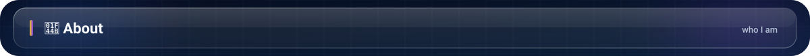
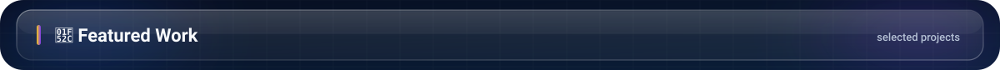
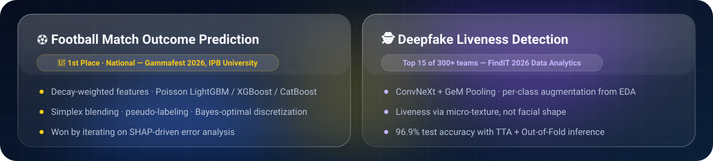
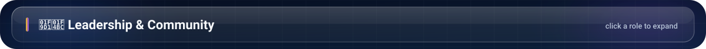
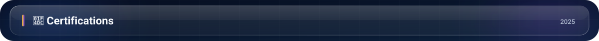

  &nbsp;
  &nbsp;
  &nbsp;
  

 

<table>
<tr>
<td width="60%" valign="top">

I'm a **Data Science student at BINUS University** who learns fastest by **building and competing** — a habit that has led to **two national Data Science titles** so far.

I'm as comfortable **leading people** as I am **training models**: I head the Kemanggisan region of **BNCC (250+ members)** and have run large student programs end to end — from a **5,800-registrant national AI seminar** to a **research paper on imbalanced-data models**.

I care about work that **genuinely reaches people**.

</td>
<td width="40%" valign="top">

| | |
|:--|:--|
| 🎓 **Education** | B.Sc. Data Science, BINUS University |
| 📊 **GPA** | 3.94 / 4.00 |
| 🏆 **National titles** | Gammafest 2026 · SHINE 2025 |
| 🧑‍💼 **Leading** | 250+ members, 7 sub-divisions |
| 🔬 **Research** | Co-author — Random Forest on imbalanced data |
| 🧪 **Team** | Data Seekers (1 of 12 from 28) |

</td>
</tr>
</table>

 

| | Competition | Organizer | Result | Approach |
|:-:|:--|:--|:--|:--|
| 🥇 | **Gammafest 2026** · Data Science Competition | IPB University | **1st Place — National** | LightGBM · XGBoost · CatBoost · SHAP |
| 🥇 | **SHINE 2025** · Data Science Competition | BINUS University | **1st Place — National** | Scikit-learn · Feature Engineering |
| 🏅 | **FindIT 2026** · Data Analytics | — | **Top 15 of 300+ teams** | ConvNeXt · GeM Pooling · TTA |
| 🏅 | **COMPFEST 17** · Data Science Academy | Universitas Indonesia | **Top 10 of 200 teams** | — |
| 🏅 | **Techfest** · Data Analytics | HIMTI BINUS | **Top 5** | — |
| 🏅 | **Data Clash** | Neurontara | **Top 10** | — |
| 🎯 | **Samsung Solve for Tomorrow 2025** | Samsung | Semifinalist | — |
| 🎯 | **Makarapreneur** · Business Plan | — | Semifinalist | — |

 

  
  
  

  

 

 

<b>Chief Operating Officer (Regional Head)</b> — Bina Nusantara Computer Club, Kemanggisan &nbsp;·&nbsp; <i>Sep 2025 – Present</i>

 

- Set the region's strategic direction and targets, then run day-to-day operations across **7 sub-divisions** — 29 management committee and 73 activists.
- Main link between BNCC and BINUS — keeping the region aligned with university policy and building a strong club–university relationship.
- Oversaw a large-scale leadership training for **100+ activists** from the Bandung, Alam Sutera, Kemanggisan, and Malang campuses.
- Started a bi-weekly transition sync between outgoing and incoming executive committees, cutting miscommunication and smoothing the handover.

<b>Person in Charge</b> — BNCC CSR 2025, <i>"Level Up Your Learning Game with AI"</i> &nbsp;·&nbsp; <i>May – Sep 2025</i>

 

- Led a **36-person committee** across 5 divisions to plan and run a national AI seminar featuring Agatha Chelsea and Hafiz Kasman.
- Pivoted the speaker and partnership strategy after initial plans fell through.
- Used daily CSV exports of registration data to track cross-regional sign-up trends and drive targeted outreach — **5,800 registrants, 4,800 participants** (2.3× the prior year), profit **+500 %**.

<b>General Treasurer (Founding Board)</b> — BINUS Bind Career &nbsp;·&nbsp; <i>2026 – Present</i>

 

- Helped launch a new student research & innovation organization; built its financial system and budget from the ground up and oversee funding across all programs.

<b>Event & Logistics Coordinator</b> — BNCC Opening Season 2025

 

- Planned the entire BOS series — Expo, Launching, and Co-Design — reaching **5,000 participants** and recruiting **650+ new members**.
- Coordinated with other BNCC regions to keep events aligned across campuses.

<b>Research, Mentorship & Recognition</b>

 

- 🔬 **Research Assistant & Co-Author** — *Implementation of Random Forest Algorithm in Handling Imbalanced Data: A Study on Default Models and Hyperparameter Tuning*, BINUS University.
- 🧪 **Data Seekers** — BINUS Data Science competition team; selected as 1 of 12 from 28 applicants.
- 🎓 **SASC Scholarship Mentor** — selected from 1,000+ applicants; mentored 6 students across two consecutive cycles.
- 🧭 **Freshmen Leader & Partner** — guided 33 freshmen with a team of 7 through their first-year transition.
- 🛡️ **Student Ethics Ambassador 2025** — selected by the BINUS Research Office.
- ➗ **Volunteer Math Teacher** — Teach For Indonesia, Grade 5.

 

| Certification | Issuer | Year |
|:--|:--|:-:|
| Intermediate Data Science | Digital Talent Scholarship — Ministry of Communication & Digital Affairs (KOMDIGI) | 2025 |
| SAP Analytics Cloud | ASEAN Data Science Explorer — ASEAN Foundation | 2025 |
| Data Classification & Summarization with IBM Granite | IBM × Hacktiv8 Indonesia | 2025 |

 

  
  

  

  

 

  &nbsp;
  &nbsp;
  &nbsp;
  

